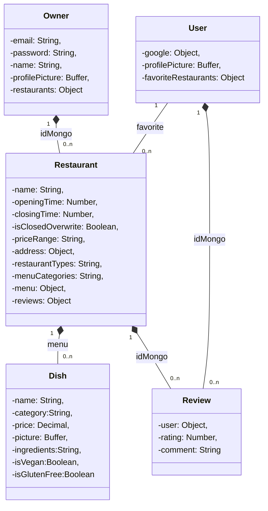

# TP Aplicaciones Distribuidas

**Requirements**

- Use npm 17 for better compatibility with this project.

## DB Setup

To connect to the db use [MongoDB Compass](https://www.mongodb.com/try/download/compass), you can connect with the following connection string:

```
mongodb://morfando-server:Bo5jew8oib12pqQg7b6reiC7IJrmVcaZo5m6khcCpmcB2lq7nL5ACA55lpQPwuCaiWty1TotfVv5n7dS4Ek9Lw==@morfando-server.mongo.cosmos.azure.com:10255/?ssl=true&replicaSet=globaldb&retrywrites=false&maxIdleTimeMS=120000&appName=@morfando-server@
```

## How to run the project

This project is based on: https://www.bezkoder.com/node-express-mongodb-crud-rest-api/

- Install dependencies:

```bash
npm i
```

- Start Server:

```bash
npm start
```

- Run the linter, it will automatically fix most issues:

```bash
npm run lint 
```

- Update swagger:

This command will autogenerate the swagger json file using this package: https://github.com/davibaltar/swagger-autogen

```bash
npm run swagger
```

The docs are exposed on http://localhost:8000/docs

When merging to main the project will be automatically deployed to: https://morfando.azurewebsites.net/. If everything is ok it will return a healthy message by default.

## Diagrama de estructura de la base de datos MongoDB



